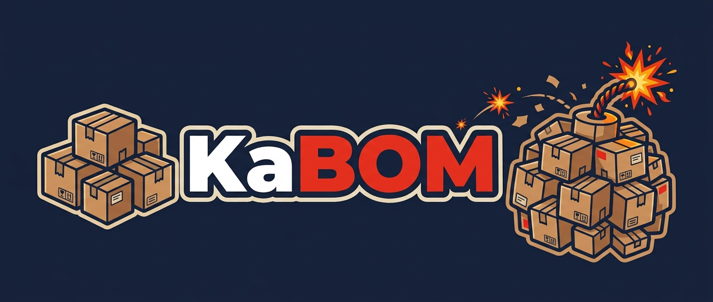

*Your SBOMs, without the enterprise.*

Reads CycloneDX SBOMs out of MinIO and lets one person search them:
**"do we have this package, and where?"** Built for a homelab with a few dozen
SBOM files, not a company with thousands. It never scans anything — Grype does
that elsewhere, KaBOM only reads what that job wrote.

## Why

A homelab is never homogeneous. Packages arrive by half a dozen different
routes: `apt` on one host, a distro image on another, a pile of container
images pulled from as many registries, plus whatever a language package
manager dragged in underneath.

When a CVE lands, the only question that matters is **"am I running that, and
where?"** — and answering it means checking each host and each image
separately, by hand, in a different way each time.

Scanners like Syft and Grype already solve the hard half: they produce an SBOM
per host and per image, and they flag the vulnerable ones. What is missing at
this size is somewhere to *put* the results that you can actually query
across. The full-size answer to that is OWASP Dependency-Track, which is
excellent and wants 8 GB of RAM, four cores and its own Postgres — more than
the whole fleet it would be watching.

KaBOM is the small version: point it at the bucket the nightly scan already
writes to, and search every host and image at once.

## Quick start

```bash
docker compose up --build
# http://localhost:8090 — login: kabom-dev / kabom-dev-only-not-a-real-password
```

Brings up KaBOM against a local MinIO seeded from `dev-sboms/` — real `syft`
output for three Alpine images that share `libssl3`, `musl` and `busybox` at
different versions, so searching one package actually shows the thing KaBOM
is for. No real credentials, never touches the production bucket.
`docker compose down -v` tears it down.

Every `*.json` in `dev-sboms/` gets uploaded, so dropping your own Syft output
in there is enough to browse it — see [`dev-sboms/README.md`](dev-sboms/README.md).

The default seed is deliberately **red**: one file in the mix is corrupted, so
the banner reports the failed read out of the box instead of hiding it.
`KABOM_SEED_SCENARIO=fresh` or `=amber` gives the other two colours.

## The freshness banner

The one thing KaBOM must never do is answer *"no, we don't have that package"*
from month-old data. So every page carries a banner — always visible, never
dismissible, driven by the **oldest** SBOM's age, never the newest and never
an average:

| | When | Example |
|---|---|---|
| 🟢 | oldest < 24h, nothing failed | `Updated 20 minutes ago · 27 of 27 read` |
| 🟡 | oldest 24h–7d | `Updated 2 days ago · 27 of 27 read` |
| 🔴 | oldest ≥ 7d, age unknown, **or** any file failed to parse | `STALE — oldest data is 39 days old · 25 of 27 read` |

When it is red, search results get a red border too — the warning belongs next
to the answer, not only at the top of the page.

## Development

```bash
uv sync                                     # install (fetches its own Python 3.12)
uv run pytest                               # tests
uv run ruff check . && uv run ruff format . # lint, format
uv run uvicorn kabom.main:app --reload      # dev server
./scripts/build-css.sh                      # recompile Tailwind after template edits
```

The dev server needs the `KABOM_*` variables under [Configuration](#configuration);
`docker compose` sets all of them for you.

Three screens, server-rendered with Jinja2 + HTMX, Tailwind via the standalone
CLI — no npm, no bundler, no `node_modules` in the runtime image. Search works
with the keyboard alone, and with HTMX blocked it degrades to a plain form GET
rather than a dead box.

### End-to-end tests

```bash
./tests/e2e/run-e2e.sh
```

Playwright against the real compose stack, cycling all three seed scenarios:
keyboard search, all three screens, all three banner colours, the red border,
and JS-blocked degradation, on desktop and mobile viewports. Runs in CI too.

## Configuration

| Variable | |
|---|---|
| `KABOM_S3_ENDPOINT` `KABOM_S3_BUCKET` `KABOM_S3_ACCESS_KEY` `KABOM_S3_SECRET_KEY` | MinIO, read-only. Required. |
| `KABOM_DB_PATH` | SQLite file. Defaults to `/data/kabom.sqlite3` in the image. |
| `KABOM_REFRESH_MINUTES` | Background re-ingest interval. Default 60. |
| `KABOM_AUTH` | `basic` or `google`. Required — there is no unauthenticated mode. |
| `KABOM_SESSION_SECRET` | Signs the login session cookie. Required in both modes; the app refuses to start without it rather than generating one, since a generated secret logs everyone out on every restart. |
| `KABOM_BASIC_USER` `KABOM_BASIC_PASSWORD_HASH` | Basic mode. A bcrypt hash, never a plaintext password. |
| `KABOM_GOOGLE_CLIENT_ID` `KABOM_GOOGLE_CLIENT_SECRET` `KABOM_ALLOWED_EMAILS` | Google mode. `ALLOWED_EMAILS` is an explicit allow-list, never a domain match. |
| `KABOM_INSECURE_COOKIES` | Set to `1` to drop the `Secure` flag on the session cookie. **Local http development only** — without it a browser will not send the cookie back over plain HTTP and login silently loops. |

### Signing in

A browser gets a real login page at `/login` — never the native basic-auth
popup, because KaBOM does not send a `WWW-Authenticate` challenge. Signing in
sets a signed session cookie; `Sign out` clears it.

API clients skip all of that and send `Authorization: Basic` on every
request, which is what `curl -u user:pass https://kabom.example.com/api/status`
already does. `/healthz` is the only route that needs nothing at all.

To try Google sign-in against the local stack:

```bash
cp docker-compose.override.yml.example docker-compose.override.yml
cp .env.example .env        # then fill in the client ID and secret
docker compose up --build
```

Compose merges the override and reads `.env` on its own. Add
`http://localhost:8090/auth/callback` to the client's authorized redirect
URIs — Google special-cases localhost, so plain HTTP is fine there. Both
files are gitignored: `.env` holds a real secret, and committing the
override would flip everyone's `docker compose up` to Google mode and break
the Playwright suite, which drives the basic-auth form.

## API

```
GET  /                          search UI
GET  /sboms                     inventory UI, oldest first
GET  /sboms/{id}                contents UI
GET  /api/search?q=&version=    substring name match, exact optional version
GET  /api/sboms
GET  /api/sboms/{id}
GET  /api/status                last run, plus age of the OLDEST sbom
POST /admin/refresh             ingest now
GET  /healthz                   the only unauthenticated route
```

Every search result carries its own `generated_at`, so nothing has to make a
second request to know whether to trust the first. No pagination, no fuzzy
matching, no CVE data — KaBOM has no opinion about what is dangerous.

## Image

Multi-arch (`amd64` + `arm64`), non-root, runs with a read-only root
filesystem given one writable mount for the SQLite file:

```bash
docker run --rm --read-only --tmpfs /tmp -v "$(pwd)/data:/data" \
  -e KABOM_S3_ENDPOINT=... -e KABOM_AUTH=basic ... \
  -p 8000:8000 ghcr.io/wawrepo/kabom:latest
```

Publishing is deliberate: a **GitHub Release** with a `vX.Y.Z` tag builds and
pushes to GHCR (tagged `X.Y.Z`, `X.Y`, `latest`). A non-semver tag fails the
workflow instead of publishing, and pushing to `main` never publishes at all.

## Kubernetes

```bash
helm install kabom charts/kabom \
  --set env.s3Endpoint=... --set env.s3Bucket=sboms --set secretName=kabom-secrets
```

Deployment, Service, Ingress, PVC. One replica, `ClusterIP`, no autoscaling —
KaBOM has exactly one deployment, forever. The chart **does not create the
Secret**; it references an existing one by name, so whatever you already use
to manage secrets (SOPS, Sealed Secrets, an external operator) keeps owning
them.

**Give `persistence.storageClass` a volume with real POSIX locking** — node
local storage is the obvious choice. SQLite corrupts on SMB/CIFS, which rules
out most NAS-backed classes. That pins the pod to one node; with a single
replica and a rebuildable database that is a fair trade, since the source of
truth is the bucket and a full re-ingest takes seconds.

`helm lint charts/kabom` and `helm template kabom charts/kabom` validate the
chart without a cluster. Both run in CI.

## License

[MIT](LICENSE).
